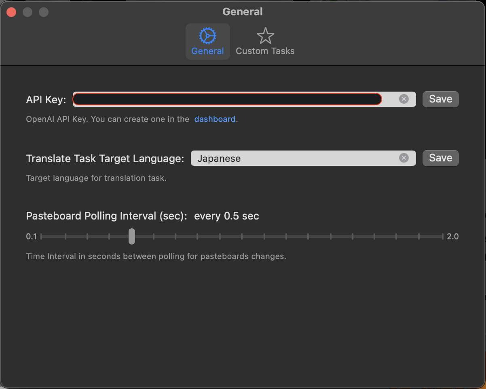
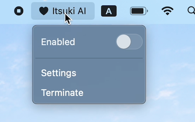

# Clipboard AI Chat (MacOS)

Ask ChatGPT to complete tasks by passing in necessary information using Clipboard (Pasteboard).

Accepted Items type:
- Image
- Text

*Other types such as files or powerpoint slides will be ignored.*

## Motivation
By having the app polling the changes in the clipboard (pasteboard) automatically, we can eaily passing information using Command+C for regular copy, Shift+Control+Command+3, or Shift+Control+Command+4 for screenshots.

This can save us a lot of effort in trying to get together the  information we need AI to perform tasks on!

## Demo

### Add to Clipboard, Manage Items, and send to ChatGPT

### Settings
#### General

#### Custom Tasks

## Capabilities

- Get necessary information for performing the task by polling on Pasteboard
- Execute pre-defined system tasks such as summarize, analyze, explain, translate, and code enhance.
    - configure target language for translate task.
- Pre-Define common used custom tasks and prompts (with a maximum of 5) and execute with a single click.
- Execute one-time-only task and prompt
- Manage clipboard items before sending to ChatGPT
- Temporarily enable or disable the app
- Configure the polling interval on the Pasteboard

## Set Up
To use this app, all you need is a OpenAI API Key and set it up under Settings as shown in the demo above.  
If you don't have one yet, you can create it from the OpenAI [dashboard](https://platform.openai.com/api-keys).

You can open the Settings panel from the App menu.  
Here is also where you can temporarily enable, disable, as well as terminate the app.

-------
For further detail, please refer to my blog: [SwiftUI/MacOS: A Clipboard AI Chat](https://medium.com/@itsuki.enjoy/swiftui-macos-a-clipboard-ai-chat-b7ee8c895fb0).
